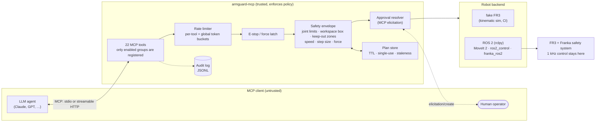
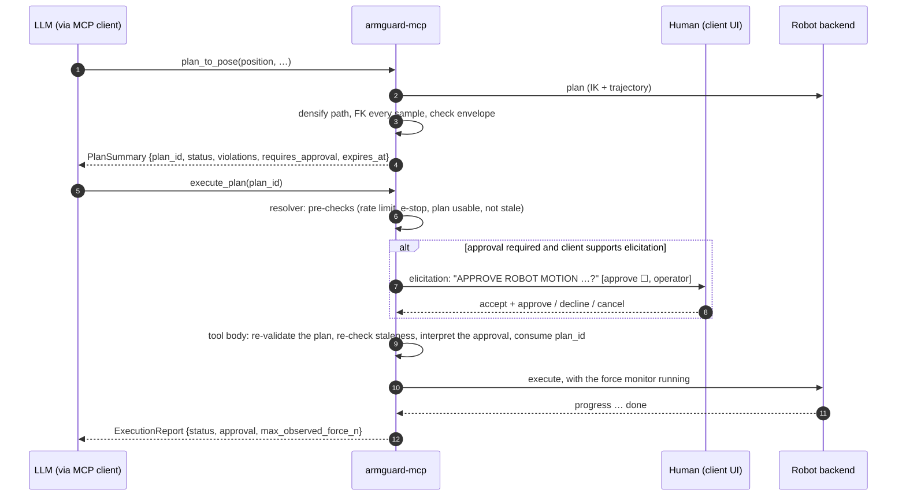

# armguard-mcp

[](https://github.com/Lynn-hh/armguard-mcp/actions/workflows/ci.yml)
[](LICENSE)


<!-- mcp-name: io.github.Lynn-hh/armguard-mcp -->

**A safety-first [Model Context Protocol](https://modelcontextprotocol.io) server for ROS 2 manipulators.**
It lets an LLM agent inspect a robot arm, plan motions, preview them and execute them. Every action passes
through a safety envelope that **the server enforces outside the model**: joint limits, a workspace box
and keep-out zones, speed and step-size caps, force/torque thresholds, allowlists, rate limits, a software
e-stop, human approval through MCP elicitation, and an audit log. A prompt, or a prompt injection hidden in
a camera image or topic string, can change what the model *asks for*. It cannot change what the server
*allows*.

> **Status: alpha.** The policy engine, safety envelope, approval flow, audit log and all 22 MCP tools run
> against a simulated Franka FR3 backend. The ROS 2 backend (MoveIt 2, `ros2_control`, `franka_ros2`) is
> tested on ROS 2 Jazzy against real rclpy endpoints and a real MoveIt 2 `move_group`. It has **not**
> been run on a physical robot yet.
>
> **This is defense in depth, NOT certified functional safety.** See
> [Safety scope and non-goals](#safety-scope-and-non-goals).

## Contents

- [How it differs from generic ROS MCP bridges](#how-it-differs-from-generic-ros-mcp-bridges)
- [Architecture](#architecture)
- [Quick start (simulated FR3, no ROS needed)](#quick-start-simulated-fr3-no-ros-needed)
- [ROS 2 backend](#ros-2-backend---backend-ros2)
- [Tool reference](#tool-reference)
- [The approval flow](#the-approval-flow)
- [Policy reference](#policy-reference)
- [Safety scope and non-goals](#safety-scope-and-non-goals)
- [Known limitations](#known-limitations)
- [Roadmap](#roadmap)
- [Citation](#citation) and [License](#license)

More detail: [docs/architecture.md](docs/architecture.md), [docs/threat-model.md](docs/threat-model.md),
[docs/demo.md](docs/demo.md) (a real transcript), [CONTRIBUTING.md](CONTRIBUTING.md).

## How it differs from generic ROS MCP bridges

Generic bridges such as [robotmcp/ros-mcp-server](https://github.com/robotmcp/ros-mcp-server) do an
excellent job of what they aim for: they connect any MCP client to any ROS 1 or ROS 2 robot through
`rosbridge`, with no changes to the robot's code. The LLM can publish to topics, call services and
actions, and set parameters. That generality is the point, and it also means the model can reach anything
the ROS graph exposes. Their open issue [#283](https://github.com/robotmcp/ros-mcp-server/issues/283)
("Unrestricted ROS service calls via MCP tool: prompt injection → robot control") describes the resulting
risk, and permissions are listed there as a feature the project welcomes.

armguard-mcp makes the opposite trade-off. It is narrow, specific to manipulators, and restrictive by
design:

| | Generic ROS MCP bridge | armguard-mcp |
|---|---|---|
| Scope | Any topic, service, action or parameter | 22 fixed skill-level tools for arms and grippers |
| What the LLM sends | Raw ROS messages | Targets (joint positions, poses, waypoints) that the server plans and checks |
| Motion model | Publish or call directly | `plan_*` returns a preview and a single-use `plan_id`, and only `execute_plan` moves |
| Limits | Whatever the robot stack enforces | Server-side YAML policy: joint limits, workspace, keep-out zones, speed, step size, force, gripper |
| Human in the loop | None built in | MCP elicitation prompt, denied by default when the client cannot ask a human |
| Arbitrary publish or service calls | Yes | No, by construction |
| Audit | None built in | Append-only JSONL of every call, approval, denial and e-stop |
| Robot coverage | Very broad (ROS 1 and ROS 2, any robot) | Manipulators; Franka FR3 first |

If you want to explore a robot freely from a chat window, use a generic bridge. If you want an agent near
a real arm with limits it cannot talk its way around, that is what this project is for.

## Architecture



The LLM is never in the control loop. MCP works at the level of skills and tasks: plan, preview, execute,
grasp. Real-time control, such as 1 kHz impedance and force control, stays in `ros2_control` and the Franka
controllers. The server checks a whole trajectory before it runs and watches the external wrench while it
runs.

## Quick start (simulated FR3, no ROS needed)

```bash
git clone https://github.com/Lynn-hh/armguard-mcp && cd armguard-mcp
python -m venv .venv && . .venv/bin/activate
pip install -e ".[dev]"
pytest -q                                   # unit tests, a few seconds (no ROS needed)

# stdio (what desktop and CLI MCP clients launch)
armguard-mcp --policy examples/policies/fr3.yaml --backend fake --audit-log audit.jsonl

# streamable HTTP on http://127.0.0.1:8765/mcp (no authentication: keep it on localhost)
armguard-mcp --policy examples/policies/fr3.yaml --backend fake --transport http --port 8765

# a scripted session: plan, execute, approval prompt, keep-out rejection, e-stop
python scripts/demo_fake.py
```

`armguard-mcp --help` lists every flag: `--policy` (required), `--backend fake|ros2`, `--ros2-config`,
`--transport stdio|http`, `--host` (default `127.0.0.1`), `--port` (default `8765`), `--audit-log`,
`--dry-run` (forces dry-run on top of the policy), `--log-level`, `--version`. Logs go to stderr only, so
stdout carries nothing but MCP messages. A policy that fails validation, or a backend that is not
available, exits with status 2 before the server starts. Binding HTTP to a non-loopback address logs a
warning.

The fake backend is a kinematic FR3 with real FR3 forward and inverse kinematics, time-scaled execution, a
Franka Hand model, generated camera images and a fake `ros2_control` graph. It starts at the policy's
`home_joint_positions`.

### Claude Code (`.mcp.json`, stdio)

Copy [examples/mcp.json](examples/mcp.json) to `.mcp.json` at your project root, or run
`claude mcp add` with the same command and arguments. Use absolute paths.

```json
{
  "mcpServers": {
    "armguard": {
      "type": "stdio",
      "command": "/abs/path/to/armguard-mcp/.venv/bin/armguard-mcp",
      "args": [
        "--policy", "/abs/path/to/armguard-mcp/examples/policies/fr3.yaml",
        "--backend", "fake",
        "--audit-log", "/abs/path/to/armguard-mcp/audit.jsonl"
      ]
    }
  }
}
```

Start with `--dry-run` or [`examples/policies/readonly.yaml`](examples/policies/readonly.yaml), which
registers only 12 read-only and safety tools, until you have read the policy. If your client does not
support elicitation, every action that needs approval is denied. That is deliberate.

### Any MCP client (Python SDK v2)

[examples/python_client.py](examples/python_client.py) is runnable; this is the core of it:

```python
from mcp.client import Client
from mcp.client.stdio import StdioServerParameters
import mcp.types as mt


async def ask_human(context, params):  # shown when the server needs approval
    print(params.message)
    ok = input("approve? [y/N] ") == "y"
    return (
        mt.ElicitResult(action="accept", content={"approve": True, "operator": "me"})
        if ok
        else mt.ElicitResult(action="decline")
    )


server = StdioServerParameters(
    command="armguard-mcp", args=["--policy", "examples/policies/fr3.yaml", "--dry-run"]
)
async with Client(server, elicitation_callback=ask_human) as client:
    plan = await client.call_tool("plan_to_pose", {"position": {"x": 0.4, "y": 0.0, "z": 0.4}})
    result = await client.call_tool("execute_plan", {"plan_id": plan.structured_content["plan_id"]})
```

For HTTP, pass the URL instead: `Client("http://127.0.0.1:8765/mcp")`.

## ROS 2 backend (`--backend ros2`)

The backend targets ROS 2 Jazzy (Python 3.12) with MoveIt 2 and franka_ros2 v3.x. Humble may work but
has not been tested. `rclpy` is imported only when the ros2 backend is created, so the package installs
and runs without ROS. If `rclpy` is missing, `--backend ros2` exits with status 2 and says what to source.

```bash
source /opt/ros/jazzy/setup.bash          # plus your franka_ros2 workspace (for franka_msgs)
python3 -m venv --system-site-packages .venv-ros && . .venv-ros/bin/activate   # sees rclpy
pip install -e .
armguard-mcp --policy examples/policies/fr3.yaml --backend ros2 \
             --ros2-config examples/ros2/fr3_franka_ros2_jazzy.yaml
```

| Capability | ROS 2 interface (default name) |
|---|---|
| Joint state | `sensor_msgs/JointState` on `/joint_states` (stale data is refused) |
| TCP pose, `lookup_transform` | tf2, `robot.base_frame` → `robot.ee_frame` |
| FK for envelope checks | MoveIt `/compute_fk`, or the built-in FR3 model (`fk_source: fr3_analytic`) |
| Planning | MoveIt `/plan_kinematic_path` (joint or pose goal), `/compute_cartesian_path` |
| Execution | `control_msgs/FollowJointTrajectory` on `/fr3_arm_controller/follow_joint_trajectory` |
| Force monitoring | `geometry_msgs/WrenchStamped` on `/franka_robot_state_broadcaster/external_wrench_in_stiffness_frame` |
| Controllers | `/controller_manager/list_controllers`, `/controller_manager/switch_controller` |
| Gripper | franka_gripper `/franka_gripper/{move,grasp,homing}`, or `control_msgs/GripperCommand` |
| Collision thresholds | franka_hardware `/service_server/set_force_torque_collision_behavior` |
| Error recovery | franka_hardware `/action_server/error_recovery` |
| Camera | `sensor_msgs/Image` (8-bit) or `CompressedImage` (PNG/JPEG), one-shot subscription |

The defaults are the names in the franka_ros2 v3.5.3 sources for a launch without a namespace. **Check
them on your setup** (`ros2 topic list`, `ros2 action list`). Every name is configurable, either in a `ros2:`
section of the policy or in a file passed with `--ros2-config`. `franka_msgs` is not in the ROS apt
repositories, so build it from franka_ros2. Without it, the gripper falls back to `GripperCommand`, and
collision thresholds and error recovery report "not supported".

How the backend behaves:

- **It runs exactly what the envelope validated.** The trajectory it sends is built from the validated
  plan's waypoints and timing. MoveIt's velocities and accelerations are attached only if they belong to
  those same points. It refuses a plan that also moves joints the policy does not cover, such as the
  fingers.
- **It fails safe.** It refuses to execute when the wrench estimate is missing or stale
  (`require_wrench`). It cancels the trajectory goal on `stop_motion`, on a force-limit abort and on a
  controller timeout. It also cancels the goal when the MCP call itself is cancelled, for example because
  the client disconnected.
- **Threading.** One rclpy node with a reentrant callback group is spun by a `MultiThreadedExecutor` on a
  daemon thread. It lives in a private `rclpy.Context` and installs no signal handlers. rclpy futures are
  bridged to asyncio with `loop.call_soon_threadsafe`, so the server must run on asyncio, which is the MCP
  SDK default. At start-up the backend waits, with a bound, for DDS discovery of its endpoints and logs
  any that are missing.

**Integration tests** (`tests_ros/`, needs a sourced ROS 2 environment; without one every test is
reported as skipped):

```bash
source /opt/ros/jazzy/setup.bash && . .venv-ros/bin/activate && pytest -q tests_ros
```

The tests use a random `ROS_DOMAIN_ID` and `ROS_AUTOMATIC_DISCOVERY_RANGE=LOCALHOST`. They drive the
backend both directly and through the full MCP server with an in-memory client. They run against an
in-process fake FR3 cell made of real rclpy endpoints:

- joint states and tf
- a best-effort wrench topic
- a `FollowJointTrajectory` server that interpolates in real time and honours cancel requests
- controller_manager services
- MoveIt-like planning and FK services
- franka_gripper actions
- franka_hardware services
- camera topics

`test_moveit_live.py` also starts a real MoveIt 2 `move_group`, using the Panda from
`moveit_resources_panda_moveit_config` (same kinematic structure as the FR3). It checks OMPL planning, KDL
IK, Cartesian paths and `/compute_fk` end to end. It is skipped when MoveIt is not installed.

## Tool reference

This table is generated from the tools the server actually registers:
`python scripts/gen_tool_table.py`. Parameters with `?` are optional. Annotations are MCP tool hints
(`read_only_hint`, `destructive_hint`, `idempotent_hint`, `open_world_hint`) meant for clients; the server
enforces the policy whatever the client does with them.

| Tool | Group | Parameters | Annotations | Description |
|---|---|---|---|---|
| `get_robot_state` | introspect | none | read-only, idempotent, open-world | Current joint positions [rad], TCP pose [m, quaternion xyzw] in the robot base frame, estimated external wrench [N, N*m], gripper state and safety status. |
| `get_safety_envelope` | introspect | none | read-only, idempotent | The limits the server enforces (joint limits, workspace box, keep-out zones, speed/step caps, force thresholds, gripper limits, approval mode). |
| `lookup_transform` | introspect | `target_frame`, `source_frame` | read-only, idempotent, open-world | Pose of source_frame expressed in target_frame (tf2 semantics), e.g. target_frame='fr3_link0', source_frame='fr3_hand_tcp'. |
| `list_controllers` | introspect | none | read-only, idempotent, open-world | ros2_control controllers with their type and state, plus which ones the policy lets you switch. |
| `list_ros_graph` | introspect | none | read-only, idempotent, open-world | ROS 2 nodes, topics, services and actions visible to the server. |
| `get_audit_tail` | introspect | `n?` | read-only, idempotent | The last n audit-log events (tool calls, approvals, denials, e-stops). |
| `camera_snapshot` | perception | `topic` | read-only, idempotent, open-world | Grab the latest image from an allowlisted camera topic (see get_safety_envelope.camera_topics). |
| `plan_to_joints` | motion | `joint_positions`, `velocity_scaling?`, `acceleration_scaling?` | read-only, open-world | Plan (do NOT move) a joint-space motion from the current state to joint_positions [rad]. |
| `plan_to_pose` | motion | `position`, `orientation?`, `frame_id?`, `velocity_scaling?`, `acceleration_scaling?` | read-only, open-world | Plan (do NOT move) a motion that brings the TCP to a pose. |
| `plan_cartesian_path` | motion | `waypoints`, `frame_id?`, `velocity_scaling?`, `acceleration_scaling?` | read-only, open-world | Plan (do NOT move) a straight-line TCP path through the waypoints [m]. |
| `execute_plan` | motion | `plan_id` | destructive, open-world | EXECUTE a previously planned motion on the robot. |
| `get_motion_status` | motion | none | read-only, idempotent | Whether a plan is executing, its progress (0..1) and the result of the last execution. |
| `gripper_move` | gripper | `width_m`, `speed_mps?` | destructive, open-world | Move the gripper fingers to an opening width [m] without applying grasp force. |
| `gripper_grasp` | gripper | `width_m`, `force_n`, `speed_mps?`, `epsilon_inner_m?`, `epsilon_outer_m?` | destructive, open-world | Close the gripper on an object of about width_m [m] with force_n [N]. |
| `gripper_home` | gripper | none | destructive, open-world | Home (fully open and calibrate) the gripper. |
| `switch_controllers` | control | `activate?`, `deactivate?` | destructive, open-world | Activate/deactivate ros2_control controllers. |
| `set_collision_thresholds` | control | `force_n`, `torque_nm` | destructive, open-world | Set the robot's collision (reflex) thresholds. |
| `stop_motion` | safety | none | idempotent, open-world | Stop the current motion immediately. |
| `estop` | safety | `reason?` | idempotent, open-world | SOFTWARE E-STOP: stop all motion, invalidate every plan and refuse motion/gripper/control tools until a human approves reset_estop. |
| `reset_estop` | safety | none | open-world | Release the software e-stop (and any latched force violation). |
| `error_recovery` | safety | none | open-world | Clear the robot's error/reflex state (e.g. after a collision reflex). |
| `get_safety_status` | safety | none | read-only, idempotent | E-stop state, latched force violation, dry-run flag and the last envelope violation. |

<!-- 22 tools, generated by scripts/gen_tool_table.py from fr3.yaml -->

Points worth knowing:

- **Only enabled groups are registered.** A tool from a disabled group does not appear in `tools/list`
  at all. The `safety` group is always registered and cannot be disabled.
- **Tools that can ask a human:** `execute_plan`, `switch_controllers`, `set_collision_thresholds`,
  `error_recovery` and `reset_estop`. Their `approval` parameter is injected by the server and hidden from
  the input schema. An `approval` value that the client sends as an argument is ignored.
- **Never rate limited, never need approval:** `stop_motion`, `estop`, `get_safety_status`.
- **The plan tools don't move anything.** They are marked read-only, but they do record a plan, and a
  plan with hard violations updates `last_violation` in the safety status.
- **Refused while the software e-stop is latched:** planning, `execute_plan`, gripper, controller and
  threshold tools, and `error_recovery`. Introspection keeps working.
- **Out-of-range values are rejected, not clamped:** gripper width, speed and force, and collision
  thresholds. Velocity and acceleration scaling above the cap are *clamped* to the cap, and the plan
  summary carries a note saying so.
- **Cameras:** `camera_snapshot` only reads topics listed in `perception.camera_topics`. Images wider than
  `max_image_width` are downscaled with Pillow (`pip install armguard-mcp[image]`), or refused if Pillow is
  missing. Image bytes are redacted from the audit log.
- **Progress:** `execute_plan` streams MCP progress notifications (0..1) while the arm moves.

## The approval flow



1. **Plan.** A `plan_*` tool asks the backend for a trajectory, then samples it in joint space every
   `check_resolution_rad` and computes the TCP position of every sample with forward kinematics. It checks
   the whole path against the envelope and returns a `PlanSummary`. The full trajectory stays on the
   server.
2. **Hard or soft.** Each finding is a `Violation` with a severity.
   - **Hard** violations make the plan `rejected`, and **no approval can override them.** They are: a
     joint outside its limits anywhere along the path, the TCP leaving the workspace box, the TCP entering
     a keep-out zone, a joint travelling more than `max_joint_step_rad`, a Cartesian path longer than
     `max_cartesian_step_m`, a peak joint velocity above `max_velocity_scaling` of the joint limit, a
     scaling factor above its cap, and malformed plans.
   - **Soft** conditions (`NEAR_JOINT_LIMIT`: the goal is within `joint_limit_margin_rad` of a limit;
     `LARGE_MOTION`: travel above `soft_joint_step_rad`) mark the plan as *outside the envelope*. That makes
     its status `needs_approval` when `approval.mode` is `outside_envelope`.
3. **Execute.** Before it asks anyone, the approval resolver runs its pre-checks: the rate limit, the
   e-stop, whether another plan is executing, whether the plan is unknown, expired, used or rejected, and
   whether it is stale (the robot has moved more than `start_tolerance_rad` since planning). A request that
   fails a pre-check is denied without prompting, so a human is never asked to approve something the
   server would refuse anyway.
4. **Prompt.** If approval is required, the server sends an MCP elicitation form with an `approve`
   checkbox (unticked by default) and an `operator` name. The message states the duration, peak joint
   speed against the cap, largest joint travel, TCP path length, final TCP position, any soft warnings, and
   whether this is a dry run. [docs/demo.md](docs/demo.md) shows a real one.
5. **Decide in the tool body.** The body runs once and repeats the checks that matter: it re-validates
   the plan against the envelope and re-checks staleness. Then it interprets the outcome:
   - accept with `approve` ticked: the plan runs;
   - accept with `approve` unticked, decline, or cancel: denied.

   Every outcome goes to the audit log together with the operator name. Once the body has examined a
   plan, its `plan_id` is spent, whether the plan ran or was rejected, failed re-validation, was stale, or
   was denied approval. A call refused earlier, by the rate limit or because another plan is still
   executing, leaves the plan usable until it expires.
6. **Run.** While the arm moves, a force monitor polls the backend's external wrench at
   `force.monitor_rate_hz`. If the force or torque goes over the limit, the server stops the motion,
   **latches the software e-stop**, invalidates every outstanding plan, and returns an error that tells the
   model a human must call `reset_estop`. If the wrench cannot be read, the motion is aborted.

**When a prompt is required** (`approval_required` in `server.py`):

| `approval.mode` | `execute_plan` | `switch_controllers`, `set_collision_thresholds`, `error_recovery` | `reset_estop` |
|---|---|---|---|
| `always` | prompt | prompt | prompt |
| `outside_envelope` (default) | prompt only when there are soft violations | prompt (these actions have no notion of "inside the envelope") | prompt |
| `never` | no prompt | no prompt | prompt |

An action class that is left out of `approval.require_for` never prompts, except `reset_estop`, which the
policy loader always adds back to the list. In dry-run mode `execute_plan` never prompts because nothing
will move; the other tools still ask for approval and then report `dry_run` without acting.

**Clients without elicitation are denied by default.** If approval is required and the client did not
declare elicitation support, the result depends on `approval.on_client_without_elicitation`. With `deny`,
the default, the request is refused with a message that says why. With `allow`, it proceeds, and the audit
log records `via: no_elicitation_client`. **`allow` applies to `reset_estop` as well**, so a client without
elicitation can then release the e-stop, including a latched force violation, without any human. Keep the
default on real hardware.

**Protocol versions.** Approval uses an SDK `Resolve`-injected parameter, which works on both the
2025-11-25 (legacy) and the 2026-07-28 (multi-round-trip) protocol revisions. Tests cover `auto`, `legacy`
and `2026-07-28`. Under 2026-07-28 the SDK may run a resolver more than once per call, so resolvers only
read state. The motion, plan consumption and auditing all happen in the tool body, which runs once; see
[docs/architecture.md](docs/architecture.md#why-resolvers-are-side-effect-free).

## Policy reference

The policy is a YAML file, validated strictly (`extra="forbid"`, so unknown keys are errors). It is loaded
once at start-up, is immutable, and cannot be changed by any tool. Units: metres, radians, seconds,
newtons. Positions are in `robot.base_frame`. A worked example is
[examples/policies/fr3.yaml](examples/policies/fr3.yaml); `get_safety_envelope` returns the loaded policy
to the model.

**Top level**

| Field | Type | Default | Meaning |
|---|---|---|---|
| `version` | `1` | `1` | Schema version. Only `1` is accepted. |
| `robot` | section | required | See below. |
| `tools` | section | `{enabled: [introspect, safety]}` | Tool groups to register. |
| `workspace` | section | required | TCP workspace. |
| `motion` | section | required | Motion caps. |
| `force` | section | required | Contact limits during execution. |
| `gripper` | section or null | `null` | Required if `tools.enabled` contains `gripper`. |
| `controllers` | section | `{allowlist: []}` | |
| `perception` | section | `{camera_topics: [], max_image_width: 640}` | |
| `rate_limits` | section | see below | |
| `approval` | section | see below | |
| `dry_run` | bool | `false` | Validate and approve, but never move. `--dry-run` forces it on. |
| `ros2` | section or null | `null` | Settings for the ROS 2 backend: where its topics, services and actions are, planner settings and timeouts. The fake backend ignores it, and `--ros2-config FILE` overrides it. See [ROS 2 backend](#ros-2-backend---backend-ros2) and `Ros2BackendConfig` in `src/armguard_mcp/backends/ros2_config.py`. |

**`robot`** (all fields required)

| Field | Type | Meaning |
|---|---|---|
| `name` | str | Shown in prompts and state. |
| `planning_group` | str | MoveIt planning group (ROS 2 backend). |
| `base_frame` | str | Frame for every position in the policy and in tool results. |
| `ee_frame` | str | TCP frame. |
| `joint_names` | list[str], at least 1, no duplicates | Joint order used by every joint vector. |
| `joint_limits` | map joint → limit | Must cover exactly `joint_names`. Each limit: `min` [rad], `max` [rad] (min < max), `max_velocity` [rad/s] (> 0), `max_acceleration` [rad/s²] (> 0, default `10.0`; used by the backend's time parameterisation, not re-checked by the envelope). |
| `home_joint_positions` | list[float] | One per joint, within limits. The fake backend starts here. |

**`tools`**

| Field | Type | Default | Meaning |
|---|---|---|---|
| `enabled` | list of `introspect`, `perception`, `motion`, `gripper`, `control`, `safety` | `[introspect, safety]` | `safety` is always added. |

**`workspace`**

| Field | Type | Default | Meaning |
|---|---|---|---|
| `box` | `{min: [x,y,z], max: [x,y,z]}` [m] | required | The TCP must stay inside it at every sampled point (hard). |
| `keep_out` | list of `{name, min, max}` [m] | `[]` | Boxes the TCP must never enter (hard). |

**`motion`**

| Field | Type | Default | Meaning |
|---|---|---|---|
| `max_velocity_scaling` | (0, 1] | required | Cap on velocity scaling, and on the peak joint velocity as a fraction of `max_velocity` (hard). |
| `max_acceleration_scaling` | (0, 1] | required | Cap on acceleration scaling (hard). |
| `default_velocity_scaling` | (0, 1] | `0.1` | Used when the model gives none. Must be ≤ the cap. |
| `default_acceleration_scaling` | (0, 1] | `0.1` | Must be ≤ the cap. |
| `max_joint_step_rad` | > 0 [rad] | required | Largest travel of any joint in one plan (hard). |
| `soft_joint_step_rad` | > 0 [rad] or null | `null` | Travel above this is `LARGE_MOTION` (soft). Must be ≤ `max_joint_step_rad`. |
| `max_cartesian_step_m` | > 0 [m] | required | Largest TCP path length of one Cartesian plan (hard). |
| `plan_ttl_s` | > 0 [s] | `120` | Plan lifetime. |
| `joint_limit_margin_rad` | ≥ 0 [rad] | `0.05` | A goal this close to a limit is `NEAR_JOINT_LIMIT` (soft). |
| `start_tolerance_rad` | > 0 [rad] | `0.01` | Largest drift from the plan's start state before the plan counts as stale. |
| `check_resolution_rad` | > 0 [rad] | `0.02` | Joint-space sampling step for envelope checks. |
| `cartesian_eef_step_m` | > 0 [m] | `0.005` | Interpolation step passed to the Cartesian planner. |

**`force`**

| Field | Type | Default | Meaning |
|---|---|---|---|
| `max_contact_force_n` | > 0 [N] | required | Abort and latch the e-stop if the external force goes over this during execution. Also the ceiling for `set_collision_thresholds`. |
| `max_contact_torque_nm` | > 0 [N·m] | required | The same, for torque. |
| `monitor_rate_hz` | (0, 5000] [Hz] | `200` | Wrench polling rate while executing. |

If a motion starts with the contact force already above the limit (for example, backing out after a force
abort), it aborts only if the force rises more than 1 N (0.2 N·m for torque) above its starting value.

**`gripper`** (optional)

| Field | Type | Default | Meaning |
|---|---|---|---|
| `min_width_m` | ≥ 0 [m] | `0.0` | |
| `max_width_m` | > 0 [m] | required | Must be greater than `min_width_m`. |
| `max_grasp_force_n` | > 0 [N] | required | Larger requests are rejected. |
| `max_speed_mps` | > 0 [m/s] | required | Also the default speed. |

**`controllers`**, **`perception`**

| Field | Type | Default | Meaning |
|---|---|---|---|
| `controllers.allowlist` | list[str] | `[]` | The only controllers `switch_controllers` may activate or deactivate. |
| `perception.camera_topics` | list[str] | `[]` | The only topics `camera_snapshot` may read. |
| `perception.max_image_width` | int, 16..4096 [px] | `640` | Wider images are downscaled, or refused without Pillow. |

**`rate_limits`** (token buckets that refill continuously; `stop_motion`, `estop` and `get_safety_status`
are exempt)

| Field | Type | Default | Meaning |
|---|---|---|---|
| `global_per_minute` | int ≥ 1 | `120` | Across all tools. |
| `default_per_minute` | int ≥ 1 | `60` | Per tool, unless overridden. |
| `per_tool` | map tool → int ≥ 1 | `{}` | Unknown tool names are errors. |

**`approval`**

| Field | Type | Default | Meaning |
|---|---|---|---|
| `mode` | `always` \| `outside_envelope` \| `never` | `outside_envelope` | See [the approval flow](#the-approval-flow). |
| `on_client_without_elicitation` | `deny` \| `allow` | `deny` | What happens when approval is needed but the client cannot ask a human. |
| `require_for` | list of `execute`, `switch_controllers`, `reset_estop`, `error_recovery`, `set_collision_thresholds` | all five | `reset_estop` is always added back. |

## Safety scope and non-goals

- **This is not certified functional safety.** armguard-mcp is a software layer, written in Python, that
  runs on a general-purpose OS. It has no safety rating, no SIL or PL, and no certification under ISO 10218
  or ISO 13849. It narrows what an LLM agent can ask a robot to do. It cannot make an unsafe cell safe.
- **The real safety layer is somewhere else:** the robot's own safety system (on an FR3, the Franka safety
  configuration and collision reflexes), a risk assessment of the cell, guarding, and a hardware e-stop
  that is **always within reach of a person watching the robot**. The software `estop` tool is a
  convenience. It is not an emergency stop.
- **Get your lab's safety sign-off** before connecting this to real hardware. Start with `--dry-run`, then
  the read-only policy, then low speed caps and a small workspace.
- **Non-goals:** real-time control, collision checking of full link geometry (that is MoveIt's job),
  certified speed and separation monitoring, and protection against someone who controls the host or the
  policy file.

The threat model, including residual risks such as a human rubber-stamping approvals or a client that
fakes them, is in [docs/threat-model.md](docs/threat-model.md).

## Known limitations

- The envelope checks the **TCP point** along a densely sampled joint path. It does not check link
  geometry against the workspace or keep-out zones, so an elbow can still enter a keep-out box.
- Force monitoring uses the backend's *estimated* external wrench, polled at `monitor_rate_hz`. It is a
  software backstop behind the robot's reflexes. If the backend reports no wrench at all, the force limits
  cannot be monitored: the motion still runs, a warning is logged, and the audit record carries
  `force_monitoring: unavailable`.
- Accelerations are bounded only through the scaling cap and the backend's time parameterisation. The
  envelope re-checks velocities from the trajectory timing, but not accelerations.
- `plan_to_pose` interpolates in joint space, so the TCP does not move in a straight line; use
  `plan_cartesian_path` when you need one.
- The HTTP transport has **no authentication** in this build. Use stdio, or bind to `127.0.0.1` and reach
  it through an SSH tunnel.
- The fake backend is kinematic only. It has no dynamics, no self-collision and no reflex model. When run
  from the CLI it has no table, so contact forces are zero; the tests add a virtual table to exercise the
  force limits.
- The audit log is append-only by convention (opened in append mode, one fsync per record). It is not
  tamper-evident.
- Python 3.10 is in the CI matrix, but the author has only run the suite locally on 3.12.
- `docker/` is an **experimental, untested** sketch.
- The ROS 2 backend has been tested against simulated endpoints and a real `move_group`, but not against
  franka_ros2 on a physical FR3. Check the topic, service and action names, the wrench frame and the
  collision-threshold semantics on the real cell before you rely on them.
- With the ROS 2 backend, force monitoring can react only as fast as the wrench topic is published and the
  trajectory controller handles a cancel request. With `require_wrench: true` (the default), a missing
  or stale wrench makes `execute_plan` refuse to move, and `get_robot_state` return an error.
- `stop_motion` cancels only goals that armguard sent. It does not stop motions started by other tools,
  for example MoveIt in RViz.

## Roadmap

- [x] ROS 2 Jazzy backend: MoveIt 2 planning, `FollowJointTrajectory` execution, `controller_manager`,
      `franka_ros2` gripper, collision thresholds and error recovery, tf2, camera topics (tested in
      simulation and against a real `move_group`; see `tests_ros/`).
- [ ] Bring-up on a physical FR3 with franka_ros2: check topic names, the wrench frame and the
      collision-threshold semantics, and measure how quickly the force monitor reacts.
- [ ] Isaac Sim demo: FR3 with MoveIt in simulation, driven by an agent through armguard-mcp.
- [ ] Video on a real Franka FR3, with the hardware e-stop visible in frame.
- [ ] Learned-skill actions from Isaac Lab exposed as skill tools, for example `insert_peg` with force
      feedback. The policy would run in the real-time loop, with armguard checking its preconditions and
      force envelope.
- [ ] A benchmark of LLM tool-use safety on manipulators: unsafe requests, ambiguous goals, and prompt
      injection through camera images, topic strings and tool outputs, measured with and without the
      server-side envelope.
- [ ] Authenticated HTTP transport (MCP authorization), and a tamper-evident audit log with a hash chain.
- [ ] Link-geometry workspace checks.
- [ ] Publish to PyPI and the MCP Registry (`server.json` is prepared).

## Citation

If you use armguard-mcp in academic work, please cite:

```bibtex
@software{he_armguard_mcp_2026,
  author  = {He, Lin},
  title   = {armguard-mcp: A Safety-First Model Context Protocol Server for ROS 2 Manipulators},
  year    = {2026},
  version = {0.1.0},
  url     = {https://github.com/Lynn-hh/armguard-mcp},
  note    = {University of Tennessee, Knoxville}
}
```

Lin He, University of Tennessee, Knoxville. Research on contact-rich manipulation with a Franka FR3.

## License

[Apache License 2.0](LICENSE). Copyright 2026 Lin He.
