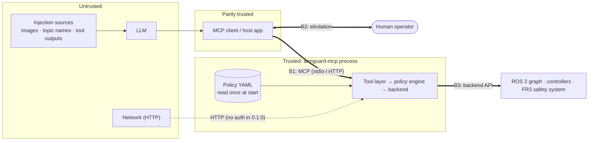

# Threat model

This document covers armguard-mcp 0.1.0. It describes what the server protects, who it defends against,
where the trust boundaries are, which code handles each threat, and what it does **not** protect against.
Every mitigation below names the code that implements it. If you find a mismatch between this document and
the code, treat it as a bug.

> armguard-mcp is **defense in depth, not certified functional safety.** The robot's own safety system (on
> a Franka FR3, the safety configuration and collision reflexes), a risk assessment of the cell, and a
> hardware e-stop within reach remain the real safety layer. This threat model covers the software path
> from an LLM to a motion command.

## 1. Assets

| Asset | Why it matters |
|---|---|
| **People and equipment near the robot** | This is what everything else exists to protect. An unintended motion, or excessive force, can injure a person or damage the robot, the fixtures or the workpiece. |
| **Integrity of motion commands** | Only plans that the server validated, and that were approved when approval is required, may reach the robot. |
| **The safety policy** (`policy.py`, the YAML file) | It defines what "safe enough" means. If an attacker could change it, every other control would fall with it. |
| **Safety state** (`safety/state.py`) | The e-stop and force-violation latches must not be cleared without a human. |
| **The approval decision** | "A human approved this" has to be true. |
| **Audit log** (`safety/audit.py`) | The record of who asked for what, and who approved it, used after incidents. |
| **Camera images** | They can contain people or confidential lab setups. They are also an input channel for attacks (see below). |

## 2. Actors

| Actor | Trust | Capabilities |
|---|---|---|
| **LLM agent** | Untrusted: may be wrong, confused, or steered by an attacker | Calls any *registered* tool with any arguments, repeatedly, in any order. |
| **Prompt-injection sources** | Untrusted | Text in camera images (read by the model), ROS topic, node and frame names returned by `list_ros_graph` or `lookup_transform`, error strings, tool outputs of other MCP servers in the same client, documents pasted into the chat. Research shows that these channels work against LLM-controlled ROS 2 robots ([RIPA, arXiv:2606.28649](https://arxiv.org/abs/2606.28649)). |
| **MCP client (host application)** | Partly trusted: relays elicitation prompts to the human | A buggy or malicious client can send arbitrary JSON-RPC, skip or fake elicitation answers, forge `requestState`, and flood requests. |
| **Human operator** | Trusted, but fallible | Answers approval prompts and resets the e-stop. Can get tired or distracted, and approve without reading. |
| **Network attacker** (HTTP transport only) | Untrusted | Anyone who can reach the HTTP port can act as an MCP client. |
| **Host administrator** | Fully trusted (out of scope) | Controls the policy file, the Python environment, the ROS graph and the process. |
| **Other ROS 2 nodes** | Out of scope | Anything on the same ROS domain can command the robot directly, bypassing armguard entirely. |

## 3. Trust boundaries

- **B1 (MCP boundary).** Everything that arrives here is untrusted input: tool names, arguments, the
  client's declared capabilities, and the echoed `requestState`.
- **B2 (approval boundary).** The server cannot see the human. It sees only what the client reports that
  the human answered. This boundary is only as trustworthy as the client (see residual risk R2).
- **B3 (backend boundary).** The server trusts the backend to execute what it was given, and to report
  joint state and wrench honestly. The robot's own safety system sits beyond this boundary and does not
  trust armguard.

## 4. Threats and mitigations

### T1. The LLM asks for an unsafe motion (by mistake or because it was injected)

| Mitigation | Where |
|---|---|
| The model cannot send trajectories. It sends targets; the server plans them and then validates the **whole path**: the trajectory is sampled every `check_resolution_rad`, refined until the TCP moves at most `tcp_check_resolution_m` between samples, the forward kinematics of every sample is checked, and every segment between samples is tested against the keep-out boxes (a thin zone cannot be tunnelled through). | `ArmGuard.validate_plan`, `ArmGuard._refine_tcp`, `safety/envelope.py: densify, check_plan, segment_intersects_box` |
| Hard limits: joint limits along the path, workspace box, keep-out zones, per-plan joint travel cap, Cartesian path-length cap, peak joint velocity against `max_velocity_scaling`, peak joint acceleration (from the waypoint timing, not the backend's claimed scaling) against `max_acceleration_scaling`, scaling caps, malformed or non-finite input. A plan with any hard violation is stored as non-executable. **No approval can override it.** | `check_plan`, `PlanStore.put`, `execute_plan` (the `stored.executable` check) |
| The tool body **independently re-validates** the stored plan right before execution. | `execute_plan`: `verdict, _, _ = await guard.validate_plan(stored.plan)` |
| Out-of-range gripper width, speed and force, and out-of-range collision thresholds, are **rejected, not clamped**, so an injected "force_n=500" fails loudly. Velocity and acceleration scaling above the cap are clamped, with a note in the plan summary. | `_register_gripper`, `_thresholds_precheck`, `clamp_scaling` |
| Soft conditions (near a joint limit, a large motion) require a human in `outside_envelope` mode. | `approval_required`, `finalize_plan` |
| Force/torque monitor during execution. Going over the limit stops the motion, latches the e-stop and invalidates all plans. The monitor fails closed: a wrench that cannot be read, is missing, is slower than `wrench_timeout_s` or stops updating aborts the motion; a stop command that fails latches the e-stop. Without any wrench estimate, `execute_plan` refuses to move unless the policy opts out (`force.require_wrench: false`), and the opt-out is shown in the plan summary and the approval prompt. | `ArmGuard.run_execution` (`monitor`, `safe_stop`, `latch_force_violation`), `ArmGuard.read_start_wrench` |
| `dry_run` (policy or `--dry-run`): everything is validated, nothing moves, including the gripper. | `SafetyState.dry_run`, `execute_plan`, gripper and control tools |

### T2. The LLM reaches beyond manipulation: arbitrary topics, services, parameters, shell

| Mitigation | Where |
|---|---|
| There is **no** generic publish, service-call, parameter or shell tool. The tool set is fixed at 22 skill-level tools. `list_ros_graph` is read-only. | `server.py` (tool registration) |
| Tool-group allowlist: groups that are not in `tools.enabled` are **not registered**, so they are invisible in `tools/list` and cannot be called. `safety` is always on. | `build()`, `ToolsSection._safety_always` |
| Controller allowlist for `switch_controllers`; camera-topic allowlist for `camera_snapshot`. | `_switch_precheck`, `camera_snapshot` |
| The policy is immutable at runtime. The pydantic models are frozen, and no tool edits the policy. | `policy.py` (`_Strict`, `frozen=True`) |

### T3. The LLM or client tries to bypass or forge approval

| Mitigation | Where |
|---|---|
| The `approval` parameter is injected by the server through `Resolve(...)` and is **hidden from the input schema**. A client-supplied `approval` argument is ignored. The resolver and the tool body decide, and a test sends a forged `{"approve": true}` and checks that the robot does not move. | `execute_plan` and the other approval-gated tools; `test_llm_cannot_forge_approval_through_arguments`, `test_tool_annotations_and_hidden_approval_parameter` |
| The body re-checks everything the resolver checked (e-stop, plan usability, staleness, re-validation) and interprets the approval outcome itself. If the approval requirement changed while the request was in flight, the call is denied. | `ArmGuard.check_approval` |
| Under protocol 2026-07-28, intermediate state for a multi-round-trip request travels through the client as `requestState`. The SDK **seals it with AES-256-GCM** under a per-process key with a TTL (armguard uses 300 s) and rejects tampered or foreign tokens. | `RequestStateSecurity.ephemeral(ttl=300)` in `build()`; the SDK's `mcp/server/request_state.py` |
| The approval form defaults to `approve: false`. Accept with the box unticked, decline, and cancel all deny. | `ApprovalForm`, `check_approval` |
| A client without elicitation support is **denied by default** (`on_client_without_elicitation: deny`). | `ArmGuard.approval_request` |
| `reset_estop` always requires approval, whatever `approval.mode` or `require_for` say. | `approval_required`, `ApprovalSection._reset_always` |

### T4. Replay, stale plans and time-of-check/time-of-use

| Mitigation | Where |
|---|---|
| A plan handle is a random 48-bit id (`uuid4().hex[:12]`), **single-use**, and expires after `plan_ttl_s` (120 s by default). At most 256 plans are outstanding; the oldest is evicted. | `plans.py` (`PlanStore`) |
| Plans are bound to the robot's joint state at planning time. If the robot has moved more than `start_tolerance_rad` since, the plan is **stale** and refused. | `_approve_execute`, `execute_plan` (`max_deviation`) |
| The id is spent once the body examines it, including on denial, rejection or staleness. A denied plan cannot be resubmitted: the model has to plan again, and the new plan goes through the same checks and prompt. | `execute_plan` (`plans.consume`) |
| An e-stop or a force violation invalidates **every** outstanding plan. | `PlanStore.invalidate_all` |
| Only one execution runs at a time. The slot is claimed synchronously at the top of `execute_plan` (before any `await`), so two concurrent calls cannot both pass the check, and it is released only by its owner. Controller switches, threshold changes and error recovery are refused while a plan is executing or being validated. | `SafetyState.claim_execution` / `release_execution`, the prechecks |
| A `stop_motion` or `estop` that arrives while `execute_plan` is still validating is never lost: it marks the claimed execution, which is re-checked right before the trajectory is sent, and `should_abort` also reports a latched e-stop. Gripper actions are tracked the same way and are interrupted by both tools. | `run_execution`, `SafetyState.estop`, `_actuate` |
| A cancelled `execute_plan` (client cancel, host timeout, disconnect) commands a stop, shielded from the cancellation, before it propagates; a failed stop latches the e-stop. SIGTERM stops and shuts down the backend like Ctrl-C. | `run_execution`, `ArmGuard.safe_stop`, `cli.py` |
| An approval to reset the e-stop is bound to the e-stop event it showed. A newer e-stop latched while the prompt was open is not released. | `reset_approval_form`, `reset_estop` |

### T5. Denial of service and runaway agents

| Mitigation | Where |
|---|---|
| Per-tool and global token buckets (`rate_limits`), with a tighter default for `execute_plan` in `fr3.yaml` (10 per minute). Denials are audited. | `safety/ratelimit.py`, `ArmGuard.call` |
| `stop_motion`, `estop` and `get_safety_status` are **never rate limited** and never need approval, so an agent or a human can always stop the arm, even under a flood. | `NEVER_LIMITED` |
| The approval resolver checks the rate limit without consuming it, so an over-limit request is denied **before** a human is prompted. This prevents prompt fatigue from floods. | `RateLimiter.would_allow`, `execute_precheck` |
| Plans are refused while the e-stop is latched. | `require_motion_allowed` |

### T6. Prompt injection through perception and tool outputs

The server cannot stop a model from *believing* injected text. What it can do is make sure that believing it
does not buy the attacker anything beyond what the policy already allows. RIPA reports that a rule-based
plus semantic "firewall" still let through 10.2% of obfuscated injections. armguard does not rely on
detecting injections; it bounds their effect.

| Mitigation | Where |
|---|---|
| Every action an injection might trigger goes through T1–T5: the envelope, allowlists, approval, rate limits. | as above |
| The approval prompt is built **by the server** from the stored plan (duration, peak speed, travel, final TCP, force monitoring, warnings, dry-run flag). None of its text comes from the model, so an injection cannot word the prompt to trick the human. | `ArmGuard.execute_message` |
| The one prompt that does contain model text, the `reset_estop` prompt (the `estop` reason), puts the server's facts first and shows the agent's reason on one line, in quotes, truncated to 120 characters and labelled *unverified*. | `_reset_message`, `untrusted` |
| Camera topics must be allowlisted, and images are downscaled to `max_image_width`, which limits the bandwidth for hiding text. | `camera_snapshot` |
| Image payloads are redacted from the audit log, and long strings are truncated at 2048 characters. | `safety/audit.py: redact` |

### T7. Network attacker on the HTTP transport

| Mitigation | Where |
|---|---|
| HTTP binds to `127.0.0.1` by default. A non-loopback `--host` logs a prominent warning. | `cli.py` |
| stdio is the default transport. | `cli.py` |
| **There is no authentication in 0.1.0.** See residual risk R3. | |

### T8. Repudiation: "who moved the robot?"

| Mitigation | Where |
|---|---|
| Every tool call is recorded as a JSONL line: tool, arguments, outcome (`ok`, `denied`, `error`, `dry_run`, `aborted`, `noop`, `cancelled`, `stop_failed`), plan id, verdict, approval (decision, via, operator), error. Calls rejected before the tool body runs (argument validation, resolver errors) are recorded with outcome `rejected`. So are e-stops (with their event number and source), resets, force violations, interrupted executions, server start and stop. Each line is fsynced. | `ArmGuard.call`, `_AuditedServer.call_tool`, `AuditLogger.log` |

## 5. Residual risks (not mitigated, or only partly)

| # | Risk | Guidance |
|---|---|---|
| R1 | **Rubber-stamping.** A human who approves every prompt without reading turns approval into a no-op. | Keep prompts rare: `outside_envelope` mode and a tight envelope mean that routine motions need no prompt, so the prompts that do appear mean something. Train operators, and require the `operator` field. Watch the robot, not the screen. |
| R2 | **A client that fakes approvals.** The server sees only what the client reports. A malicious or buggy client can answer `accept`/`approve: true` itself, or claim elicitation support and auto-accept. MCP offers no way to prove a human was involved. | Use a client you trust, on a machine you control. For real hardware, prefer a client that shows elicitation prompts verbatim. The audit log records `via: human` and the operator name as the client reported them; treat them as claims. |
| R3 | **HTTP without authentication.** Anyone who can reach the port can drive the robot within the policy, including answering its own approval prompts (R2). | Use **stdio**. If you need HTTP, bind to `127.0.0.1` and reach it through an SSH tunnel, or put an authenticating reverse proxy in front. MCP authorization support is on the roadmap. |
| R4 | `on_client_without_elicitation: allow` also covers `reset_estop`, so a client without elicitation can then release the e-stop, **including a latched force violation, without any human.** | Keep the default `deny` on real hardware. |
| R5 | **TCP-path workspace checks.** Links other than the TCP (the elbow, for example) are not checked against the box or keep-out zones. The TCP path is checked as chords at most `tcp_check_resolution_m` long; the true arc can deviate from them by a fraction of a millimetre. | Rely on MoveIt collision objects for scene geometry, keep keep-out zones generous, and keep the robot's own workspace limits configured. |
| R6 | **Wrench estimates and polling.** The force monitor polls an *estimated* external wrench at `monitor_rate_hz` (200 Hz by default), from Python. It is not real-time: it reacts only as fast as the wrench is published and the controller handles a stop. With `force.require_wrench: false` and no wrench estimate, a motion runs with no server-side force limit (disclosed in the plan summary and prompt, audited as `force_monitoring: unavailable`). | Configure the robot's collision thresholds and reflexes. `set_collision_thresholds` exists for that, and is capped by the policy. |
| R7 | **Other ROS 2 nodes.** armguard controls only its own path. Any node on the same `ROS_DOMAIN_ID` can command the controllers directly. | Isolate the robot's ROS domain and network. Use SROS2 where practical. |
| R8 | **Audit log integrity.** The log is append-only by convention, not tamper-evident. The in-memory tail is readable by the LLM through `get_audit_tail`, which includes operator names. | Ship logs off the host. A hash chain is on the roadmap. Disable `introspect` if operator names are sensitive. |
| R9 | **Host compromise or policy tampering.** Anyone who can edit the policy file or the Python environment defeats every control. | Out of scope. Protect the host and review policy changes like code. |
| R10 | **The robot's model is only as good as the policy.** Wrong joint limits, a wrong base frame or a wrong TCP offset make the envelope check the wrong thing. | Verify the policy against the robot's datasheet and against measured poses. `fr3.yaml` marks the velocity and acceleration values "verify for your robot". |

## 6. References

- robotmcp/ros-mcp-server, issue #283: "Security: Unrestricted ROS service calls via MCP tool — prompt
  injection → robot control". <https://github.com/robotmcp/ros-mcp-server/issues/283>
- N. Dorzhiev, "RIPA: Sensory-Vector Prompt Injection Attacks on LLM-Controlled ROS 2 Robots",
  arXiv:2606.28649, 2026. <https://arxiv.org/abs/2606.28649>
- Model Context Protocol specification, revision 2026-07-28, on elicitation and `requestState`.
  <https://modelcontextprotocol.io/specification>
- ISO 10218-1/-2 (industrial robot safety), ISO/TS 15066 (collaborative robots). armguard-mcp does not
  implement or claim conformance to either.
